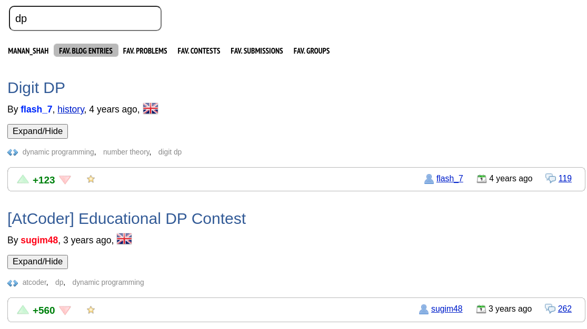
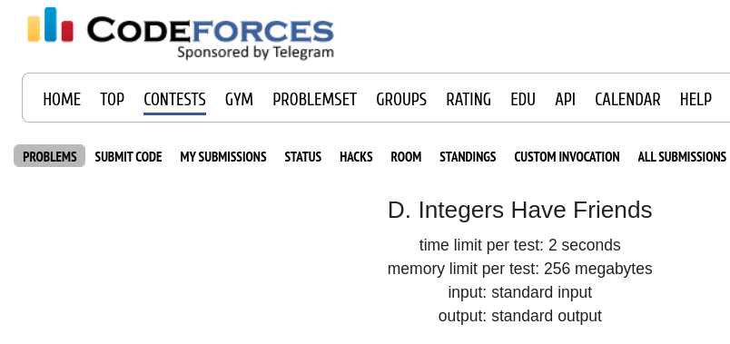
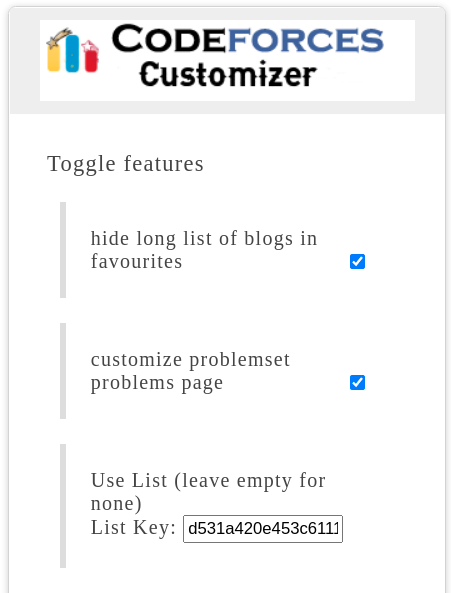

<!-- PROJECT LOGO -->
 

  
  <h3 align="center">Codeforces Customizer</h3>

  

    A chrome extension to customize codeforces.
     
    <a href="https://github.com/cs-mshah/codeforces-customizer/"><strong>Explore the docs »</strong></a>
     
    <a href="https://github.com/cs-mshah/codeforces-customizer/issues">Report Bug</a>
    ·
    <a href="https://github.com/cs-mshah/codeforces-customizer/issues">Request Feature</a>
    ·
    <a href="https://github.com/cs-mshah/codeforces-customizer/pulls">Send a Pull Request</a>
  

<!-- ABOUT THE PROJECT -->

## About The Project

Wouldn't it be nice if we had this feature on codeforces? Everyone thinks about this question, and with the same thought, I thought of creating a browser extension that would customize certain features and make the user experience better.  
Here are the current features:

### _Enhanced Blog View:_  
Codefoces provides a way to star your favourite blogs and view them under the favourites tab in your profile. But after the starring many blogs, there is a long scrollbar and it becomes very hard to get what you are looking for. Well, no need to worry anymore!  

  

 - No need to scroll through all blogs!
 - All blogs appear hidden, reducing scrolling.
 - Custom searchbar to search blog titles you are looking for.
 - Expand/Hide individual blogs to see content.
 - Works on favourite blogs and particular user blogs tab.

 

### _All submissions tab:_  

 - Directly go to all submissions (status tab) from the problem page for the current problem.

 

### _Show results with user lists by default:_  

 - No need to select the user list in problemset/contest page everytime.
 - Go to https://codeforces.com/lists and enter the list key in the input box of the extension popup and press __enter__.
 - Now the problemset/contest page will show the results using the list by default.

<!-- GETTING STARTED -->
## Getting the extension

1. Simply go to the chrome web store : [chrome extension](https://chrome.google.com/webstore/detail/codeforces-customizer/akmlgflgekmnameijijkefhochekjfgg/) and click on _add to chrome_, or,  
2. Go to [Releases](https://github.com/cs-mshah/codeforces-customizer/releases), download and extract the package. Now go to chrome://extensions/ , select load unpacked and select the src folder.

<!-- USAGE EXAMPLES -->
## Usage

All features are independent and are made to enhance the user experience. Installing the extension enables all features by default. But if you feel that you are good without one, then you can simply disable the feature in the extension popup.

<!-- ROADMAP -->
## 🚧 Roadmap

See the [open issues](https://github.com/cs-mshah/codeforces-customizer/issues) for a list of proposed features (and known issues).

<!-- CONTRIBUTING -->
## 🤝 Contributing

Contributions are what make the open source community such an amazing place to learn, inspire, and create. Any contributions you make are **extremely appreciated**.

1. Fork the Project
2. Create your Feature Branch (`git checkout -b newFeature`)
3. Commit your Changes (`git commit -m 'Added a newFeature'`)
4. Push to the Branch (`git push origin newFeature`)
5. Open a Pull Request